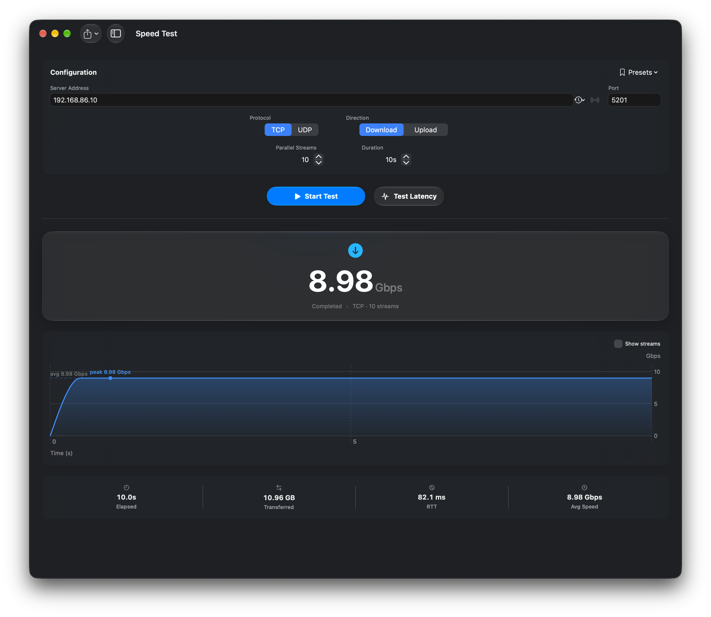

# iPerf

A native macOS app for running iperf3 speed tests, as a client or a server.

## Features

- TCP/UDP tests with live throughput chart, progress and ETA
- Server mode with this Mac's IP addresses, connected client and menu bar speed
- Discover iperf3 servers on the local network; latency probe and one-click client ping
- History with trends, compare, notes/tags, presets and Run Again
- Export results as CSV, JSON, PNG or PDF

## Download

Grab the latest build from the [Releases](https://github.com/cnetterville/iPerf/releases) page. The app is signed but not notarized, so on first launch right-click it and choose Open.

Requires macOS 26.4 or later.

## Build

Open `iPerf.xcodeproj` in Xcode and run the `iPerf` scheme. Unit tests are in the `iPerfTests` scheme.

## License

MIT for the app code, see [LICENSE](LICENSE). Third-party code is listed in [NOTICE.md](NOTICE.md).
